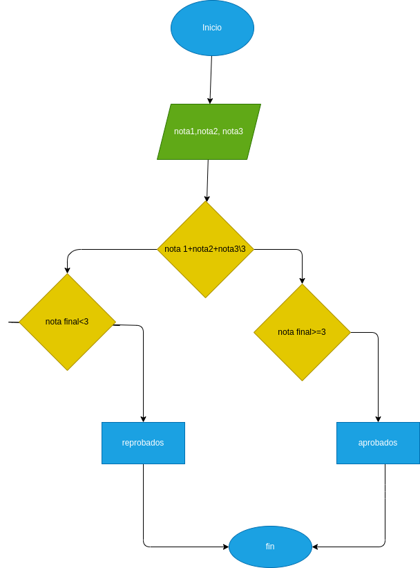

# Qué es? Para qué sirve?. El registro centinela en programacion: 

# Es un valor que se usa como condición de finalización de ingreso a una estructura repetitiva MIENTRAS. El valor o registro centinela siempre será invalido para la condición.

# Se pueda utilizar para señalar el final de la lista.Por ejemplo, sí el bucle lee una lista de números positivos, un número negativo se puede utilizar como valor centinela para indicar el final de la lista.

# Informacion tomada de: https://www.glosarioit.com/Centinela 
# https://www.youtube.com/watch?v=ju2EypSdr1U
# https://tutorias.co/preguntas-respuestas/que-es-un-registro-centinela.html

# caso 1

